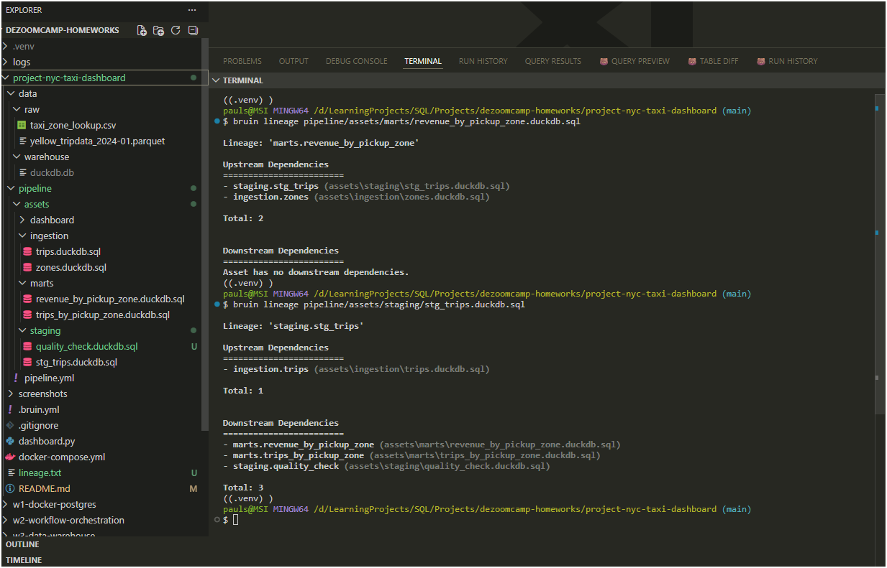

⭐ Built using Bruin for ingestion, transformation, and orchestration

💡 This project demonstrates a production-style data pipeline design using modular layers and reproducible orchestration.

# NYC Taxi Data Pipeline & Dashboard 🚕📊

## Problem Statement

Build an end-to-end batch data pipeline to analyze NYC taxi trip patterns and revenue distribution using January 2024 data.

---

## Architecture

```
Raw Data (Parquet + CSV)
        ↓
Ingestion (Bruin)
        ↓
DuckDB Warehouse
        ↓
Staging (cleaned trips)
        ↓
Marts (aggregations)
        ↓
Streamlit Dashboard (2 tiles)
```
---
## Pipeline Lineage


---

## Dataset

* Yellow Taxi: January 2024
* Taxi Zone Lookup

---

## Pipeline

Includes data quality validation and lineage tracking for pipeline observability.

### Ingestion

* Load raw parquet and CSV into DuckDB

### Transformation

* Clean and filter invalid trips
* Standardize schema

### Marts

* Trips by pickup zone
* Revenue by pickup zone

---

## Dashboard

### Tile 1 — Trip Volume

Top 10 pickup zones by total trips

### Tile 2 — Revenue

Top 10 pickup zones by total revenue

---

## Results

* Raw trips: **2,964,624**
* After filtering: **2,872,021**

---

## How to Run

```bash
cd project-nyc-taxi-dashboard

bruin run pipeline --config-file .bruin.yml
python -m streamlit run dashboard.py
```

---

## Data Quality Checks

Basic validation applied:
- No null pickup/dropoff timestamps
- No zero/negative trip distance
- No zero/negative total amount

---

## Screenshots

### Pipeline Run


### Dashboard


---

## Tech Stack

* Bruin (orchestration + transformations)
* DuckDB (warehouse)
* Streamlit (dashboard)
* Python

---

## Key Learnings

* Built a complete batch data pipeline
* Used DuckDB for fast local analytics
* Integrated orchestration + dashboarding
* Designed a reproducible data workflow

## Design Decisions

- Used DuckDB for fast local analytics without infrastructure overhead
- Selected batch processing for simplicity and reproducibility
- Structured pipeline into ingestion → staging → marts for clarity
- Built dashboard directly on top of mart layer

## Trade-offs

- Streaming pipeline omitted for simplicity and time constraints
- Limited dataset to one month for faster iteration

## Future Improvements

- Add streaming ingestion (Kafka + Spark)
- Extend analysis across multiple months
- Deploy dashboard to cloud

All data is sourced via public URLs and can be re-downloaded using provided commands.