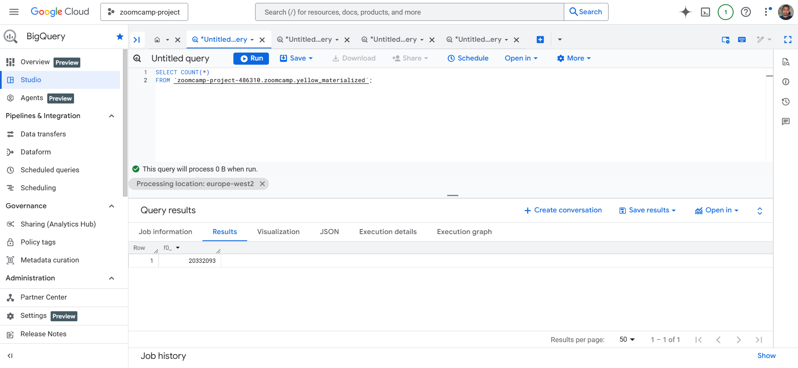
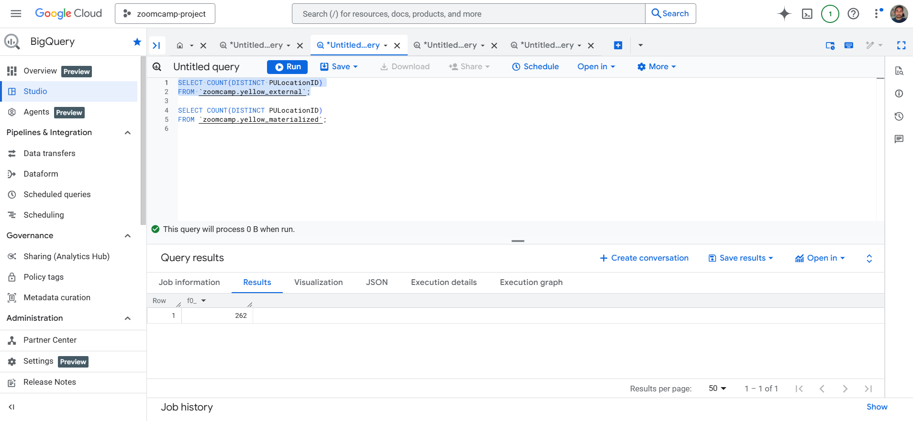
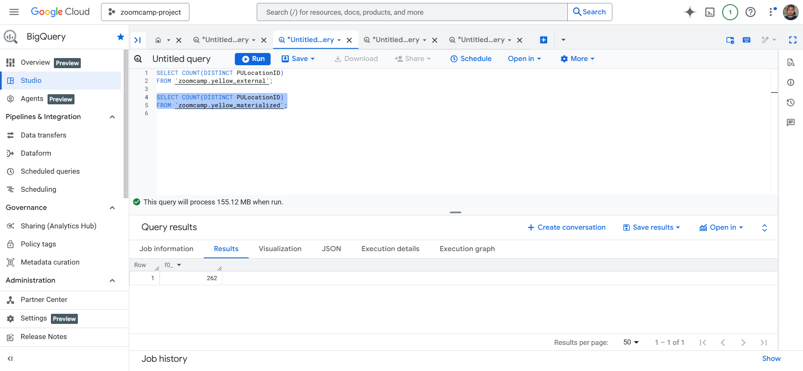
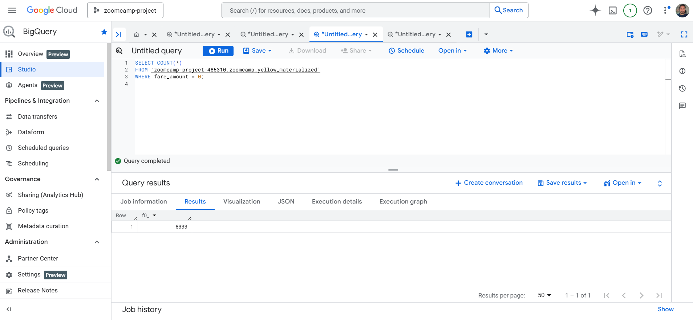
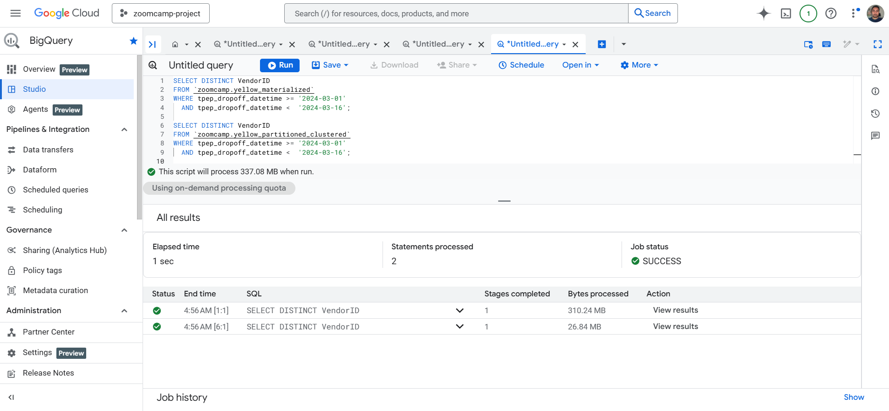
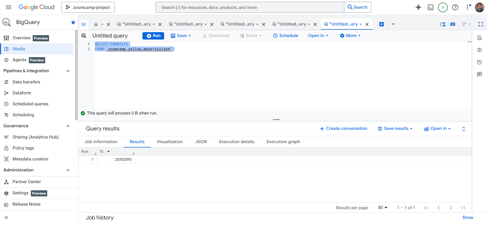

📂 Repo Structure
```
w3-data-warehouse/
├── datasets/
├── keys/
├── screenshots/
│   ├── q1_count_records.png
│   ├── q2_distinct_pulocation.png
│   ├── q4_zero_fare.png
│   ├── q6_partition_benefits.png
│   └── q9_table_scan.png
├── sql/
│   ├── bigquery_yellow_taxi_setup.sql
│   ├── bigquery_yellow_materialized.sql
│   ├── bigquery_yellow_partitioned.sql
│   └── homework_queries.sql
├── Dockerfile
├── docker-compose.yaml
├── gcs.json (ignored in .gitignore)
├── LICENSE
└── README.md
```

# Module 3 Homework – Data Warehouse (BigQuery)

## Q1. Counting records
**Answer:** 20,332,093  


---

## Q2. Data read estimation
**Answer:** 0 MB for External Table, 155.12 MB for Materialized Table  



---

## Q3. Columnar storage
**Answer:** BigQuery is a columnar database, and it only scans the specific columns requested in the query. Querying two columns (PULocationID, DOLocationID) requires reading more data than querying one column (PULocationID), leading to a higher estimated number of bytes processed.


---

## Q4. Zero fare trips
**Answer:** 8,333 trips with `fare_amount = 0`  


---

## Q5. Partitioning & clustering strategy
**Answer:** Partition by `tpep_dropoff_datetime` and Cluster on `VendorID`  


---

## Q6. Partition benefits
**Answer:** 310.24 MB for non-partitioned table and 26.84 MB for the partitioned table


---

## Q7. External table storage
**Answer:** GCP Bucket

---

## Q8. Clustering best practices
**Answer:** False — clustering is useful only when queries filter/order by specific columns.  


---

## Q9. Table scans
**Answer:** `SELECT COUNT(*)` estimates scanning the entire table, because BigQuery must read all rows to count them.  


---

## ✅ Conclusion
- External, materialized, and partitioned tables created successfully.  
- Queries confirm ingestion, anomalies, and efficiency of partitioning.  
- Screenshots provide evidence for each homework question.
