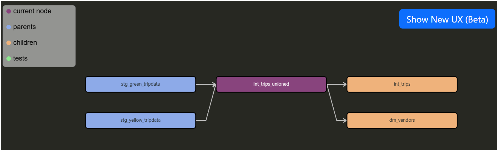
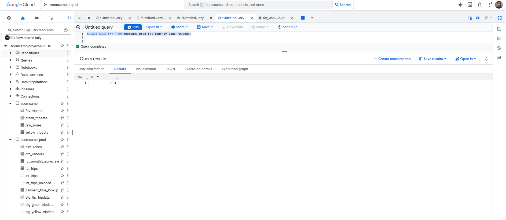
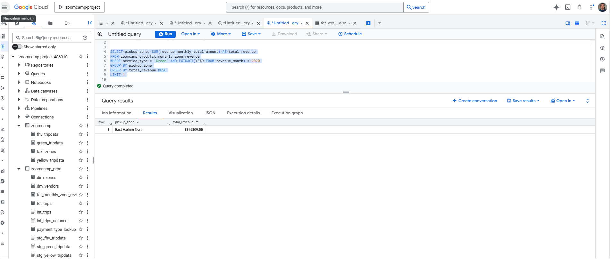
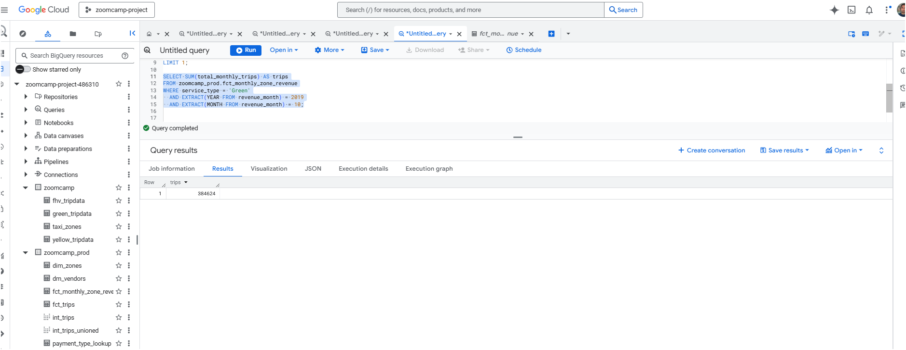
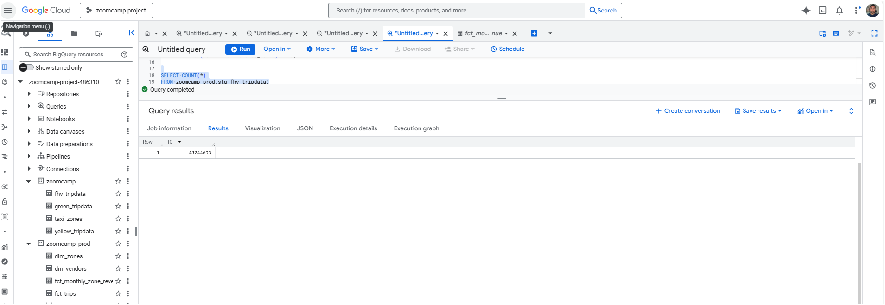

# 🧱 Data Engineering Zoomcamp – Homework 4: Analytics Engineering

## 📂 Project Structure

```
w4-analytics-engineering/
├── scripts/                  # Python ingestion scripts
│   ├── ingest.py             # Unified ingestion script (schema enforced, dynamic input)
│   └── load_data.py          # Helper script for loading data
├── models/                   # dbt models
│   ├── staging/              # Staging models (yellow, green, fhv)
│   │   ├── stg_yellow_tripdata.sql
│   │   ├── stg_green_tripdata.sql
│   │   ├── stg_fhv_tripdata.sql
│   │   └── schema.yml
│   └── marts/                # Fact and dimension tables
│       ├── dim_zones.sql
│       ├── fct_trips.sql
│       └── schema.yml
├── macros/                   # Custom dbt macros
│   └── get_vendor_names.sql
├── seeds/                    # Seed data
├── snapshots/                # dbt snapshots
├── target/                   # Compiled dbt SQL
├── data/                     # Temporary local data (auto-cleaned)
├── logs/                     # dbt logs
├── screenshots/              # Homework screenshots
│   ├── q1_ingestion_success.png
│   ├── q2_dbt_run.png
│   ├── q3_dbt_test.png
│   ├── q4_bq_external_table.png
│   ├── q5_project_structure.png
│   └── q6_fhv_rowcount.png
├── dbt_project.yml           # dbt project config
├── profiles.yml              # dbt profile
├── docker-compose.yaml       # Docker setup
├── Dockerfile                # Container definition
├── requirements.txt          # Python dependencies
├── LICENSE
└── README.md                 # Project documentation

```

## 🚀 Workflow

### 1. Ingestion
Run the ingestion script to download, convert, upload, and clean up:

bash
```
python scripts/ingest.py
```

You’ll be prompted for:

Dataset(s): yellow, green, fhv (default: all)
Year(s): e.g. 2019,2020
Month(s): e.g. 1,2,3 (default: all 12 months)
Filename (optional): e.g. green_tripdata_2019-01.csv.gz
The script enforces schema contracts for each dataset, uploads Parquet files to GCS, and deletes local files after upload.


### 2. dbt Models
Run dbt to build staging and marts:

bash
```
dbt run --full-refresh
dbt test
```

### 3. Data Quality

Tests included:

not_null on identifiers
unique on dimension keys
accepted_values on categorical fields
relationships between fact and dimension tables
Row count sanity checks


## 📊 Homework Submission

**Question 1**. dbt Lineage and Execution
Given a dbt project with the following structure:
```
models/
├── staging/
│   ├── stg_green_tripdata.sql
│   └── stg_yellow_tripdata.sql
└── intermediate/
    └── int_trips_unioned.sql (depends on stg_green_tripdata & stg_yellow_tripdata)

```

If you run dbt run --select int_trips_unioned, what models will be built?

stg_green_tripdata, stg_yellow_tripdata, and int_trips_unioned (upstream dependencies)
Any model with upstream and downstream dependencies to int_trips_unioned
int_trips_unioned only
int_trips_unioned, int_trips, and fct_trips (downstream dependencies)

**Ans** → stg_green_tripdata, stg_yellow_tripdata, int_trips_unioned





**Question 2**. dbt Tests
You've configured a generic test like this in your schema.yml:

columns:
  - name: payment_type
    data_tests:
      - accepted_values:
          arguments:
            values: [1, 2, 3, 4, 5]
            quote: false
Your model fct_trips has been running successfully for months. A new value 6 now appears in the source data.

What happens when you run dbt test --select fct_trips?

dbt will skip the test because the model didn't change
dbt will fail the test, returning a non-zero exit code
dbt will pass the test with a warning about the new value
dbt will update the configuration to include the new value

**Ans** → fails if 6 appears


**Question 3**. Counting Records in fct_monthly_zone_revenue
After running your dbt project, query the fct_monthly_zone_revenue model.

What is the count of records in the fct_monthly_zone_revenue model?

12,998
14,120
12,184
15,421

**Ans** → 12,184




**Question 4**. Best Performing Zone for Green Taxis (2020)
Using the fct_monthly_zone_revenue table, find the pickup zone with the highest total revenue (revenue_monthly_total_amount) for Green taxi trips in 2020.

Which zone had the highest revenue?

East Harlem North
Morningside Heights
East Harlem South
Washington Heights South

**Ans** → East Harlem North



**Question 5**. Green Taxi Trip Counts (October 2019)
Using the fct_monthly_zone_revenue table, what is the total number of trips (total_monthly_trips) for Green taxis in October 2019?

500,234
350,891
384,624
421,509

**Ans** → 384,624



**Question 6**. Build a Staging Model for FHV Data
Create a staging model for the For-Hire Vehicle (FHV) trip data for 2019.

Load the FHV trip data for 2019 into your data warehouse
Create a staging model stg_fhv_tripdata with these requirements:
Filter out records where dispatching_base_num IS NULL
Rename fields to match your project's naming conventions (e.g., PUlocationID → pickup_location_id)
What is the count of records in stg_fhv_tripdata?

42,084,899
43,244,693
22,998,722
44,112,187

**Ans** → 43,244,693 rows


