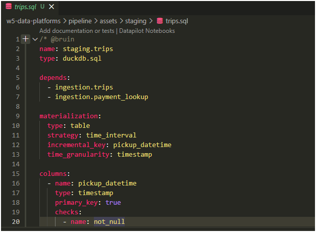
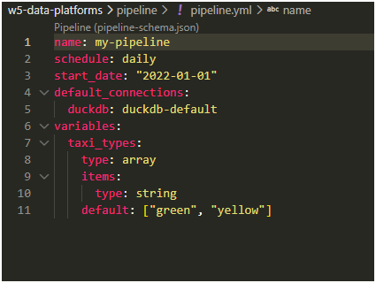
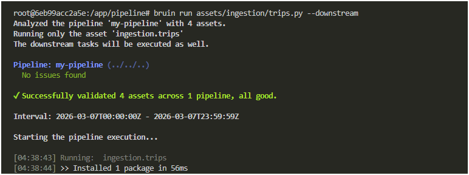
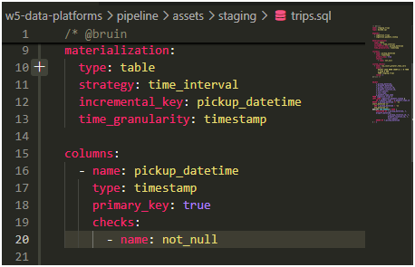
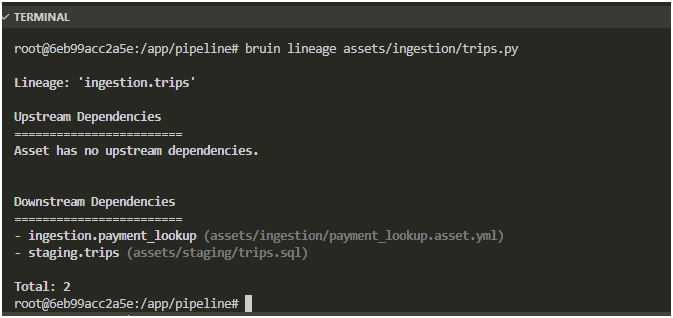
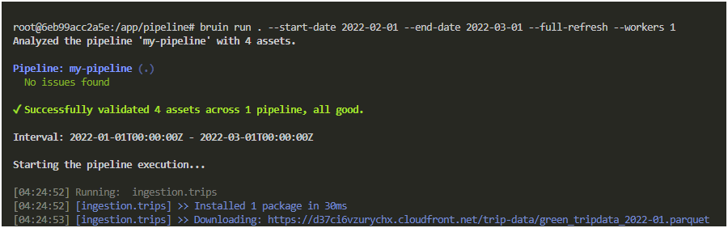

# 🧱 Data Engineering Zoomcamp – Homework 4: Data Platforms 


## 🚀 Setup
- Local environment: Python 3.11, virtualenv
- Pipeline orchestrated with Bruin CLI
- Assets organized under `pipeline/assets/` (ingestion, staging, reports, transforms)
- Used **local DuckDB** for materialization due to BigQuery access issues

## 📂 Project Structure
```
w5-data-platforms/
├── .bruin.yml
├── pipeline/
│   ├── pipeline.yml
│   ├── assets/
│   │   ├── ingestion/
│   │   │   ├── trips.py
│   │   │   ├── payment_lookup.asset.yml
│   │   │   ├── payment_lookup.csv
│   │   │   └── requirements.txt
│   │   ├── staging/
│   │   │   └── trips.sql
│   │   └── reports/
│   │       └── trips_report.sql
│
├── screenshots/         # Homework screenshots
│   ├── q1_pipeline_structure.png
│   ├── q2_materialization.png
│   ├── q3_variable_override.png
│   ├── q4_run_with_dependencies.png
│   ├── q5_quality_check.png
│   ├── q6_lineage_graph.png
│   └── q7_first_time_run_init.png
│
├── .dockerignore
├── docker-compose.yml
├── LICENSE
└── README.md

```


## 📊 Homework Submission

✅ Q1. Bruin Pipeline Structure
In a Bruin project, what are the required files/directories?  
Answer: .bruin.yml and pipeline/ with pipeline.yml and assets/  
Explanation: Bruin requires a .bruin.yml at the project root and a pipeline/ folder containing pipeline.yml and the assets/ directory.


✅ Q2. Materialization Strategies
Which incremental strategy is best for processing a specific interval period by deleting and inserting data for that time period?  
Answer: time_interval - incremental based on a time column  
Explanation: This strategy lets you reprocess only the rows for a given time window (e.g., one month of taxi data).


✅ Q3. Pipeline Variables
How do you override the variable to only process yellow taxis?  
Answer: bruin run --var 'taxi_types=["yellow"]'  
Explanation: Variables are overridden with --var and must be passed as JSON‑like strings.


✅ Q4. Running with Dependencies
You modified ingestion/trips.py and want to run it plus all downstream assets. Which command?  
Answer: bruin run ingestion/trips.py --downstream
Explanation: The --downstream selects the asset and all downstream dependencies.



✅ Q5. Quality Checks
Ensure pickup_datetime never has NULL values. Which check?  
Answer: name: not_null  
Explanation: The not_null check enforces that a column cannot contain NULLs.



✅ Q6. Lineage and Dependencies
Visualize the dependency graph between assets. Which command?  
Answer: bruin lineage
Explanation: While the VS Code extension shows this visually in a tab, the CLI command to output or inspect the dependency graph is bruin lineage.



✅ Q7. First‑Time Run
Running a pipeline for the first time on a new DuckDB database. Which flag?  
Answer: --full-refresh
Explanation: When working with incremental models or a fresh database, the --full-refresh flag tells Bruin to ignore existing state/data and recreate the tables from scratch.



▶️ Running the Pipeline

docker compose up --build
docker exec -it bruin-pipeline bruin validate pipeline
docker exec -it bruin-pipeline bruin run pipeline

✅ Results
Ingestion assets successfully executed

Transform monthly_revenue aggregated revenue by pickup zone

Materialized tables stored in local DuckDB