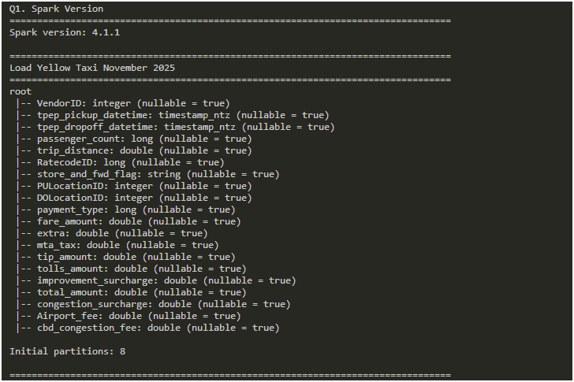
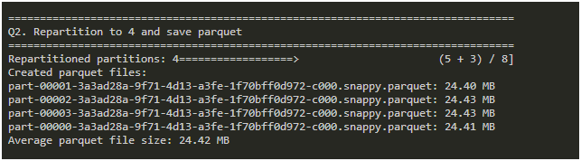
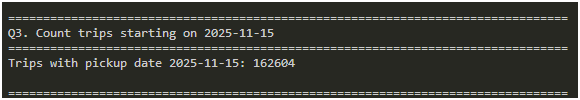
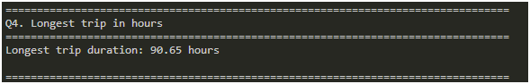
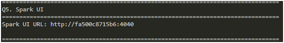
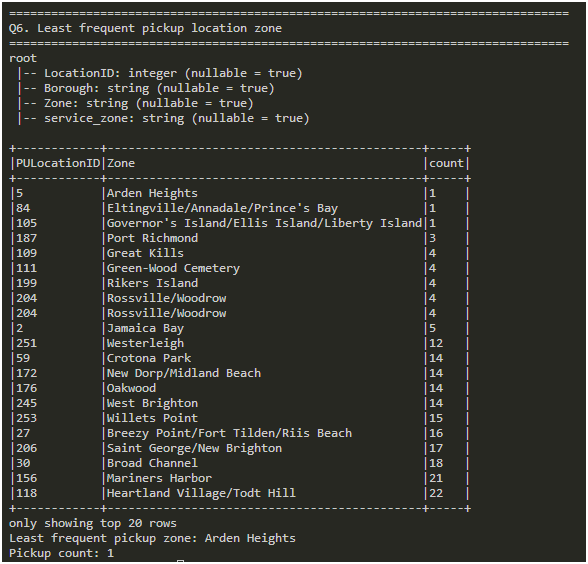

# 🧱 Data Engineering Zoomcamp – Homework 4: Batch Processing

## 🚀 Setup

- Local environment: Python 3.11, virtualenv
- Batch processing implemented using Apache Spark (PySpark 4.1.1)
- Containerized execution using Docker
- Java runtime provided via OpenJDK 21
- Input datasets stored under data/
- Spark outputs written to output/

▶️ Running the Job

Build the Docker image:

```bash
docker build -t dezoomcamp-w6 ./w6-batch
```
Run the container:

```bash
docker run --rm -it -p 4040:4040 -v "<project-path>/w6-batch:/app" dezoomcamp-w6 bash
```

Execute the batch script:

```python
python homework.py
```

Spark UI available at:

http://localhost:4040


## 📂 Project Structure

```
w6-batch/
│
├── data/ # Input datasets
│ ├── yellow_tripdata_2025-11.parquet
│ └── taxi_zone_lookup.csv
│
├── output/ # Repartitioned parquet output
│ └── yellow_2025_11_repartitioned/
│
├── screenshots/ # Screenshots for homework answers
│ ├── q1_spark_version.png
│ ├── q2_parquet_sizes.png
│ ├── q3_count_trips.png
│ ├── q4_longest_trip.png
│ ├── q5_spark_ui.png
│ └── q6_least_frequent_zone.png
│
├── homework.py # PySpark implementation for all questions
├── Dockerfile # Container environment configuration
└── README.md # Homework documentation
```

---

## 📊 Homework Submission

## Q1. Spark Version
```python
print("Spark version:", spark.version)
````

**Answer:** `4.1.1`



## Q2. Average Parquet File Size

```python
df_4 = df.repartition(4)
df_4.write.mode("overwrite").parquet(REPARTITIONED_PATH)
```

**Answer:** `24.42 MB`



## Q3. Trips on 2025-11-15

```python
q3_count = (
    df.filter(F.to_date(F.col("tpep_pickup_datetime")) == F.lit("2025-11-15"))
      .count()
)
print(q3_count)
```

**Answer:** `162604`



## Q4. Longest Trip Duration

```python
duration_df = (
    df.filter(F.col("tpep_dropoff_datetime").isNotNull() & F.col("tpep_pickup_datetime").isNotNull())
      .filter(F.col("tpep_dropoff_datetime") > F.col("tpep_pickup_datetime"))
      .withColumn(
          "trip_duration_hours",
          (
              F.unix_timestamp(F.col("tpep_dropoff_datetime")) -
              F.unix_timestamp(F.col("tpep_pickup_datetime"))
          ) / 3600.0
      )
)

q4_max = duration_df.agg(F.max("trip_duration_hours").alias("max_hours")).collect()[0]["max_hours"]
print(q4_max)
```

**Answer:** `90.65 hours`



## Q5. Spark UI Port

```python
print(spark.sparkContext.uiWebUrl)
```

**Answer:** `4040`



## Q6. Least Frequent Pickup Zone

```python
pickup_counts = (
    df.groupBy("PULocationID")
      .count()
      .join(zones, df["PULocationID"] == zones["LocationID"], "left")
      .select("PULocationID", "Zone", "count")
      .orderBy(F.col("count").asc(), F.col("Zone").asc())
)

least_row = pickup_counts.first()
print(least_row["Zone"])
```

**Answer:** `Arden Heights`



```

✅ Results
Spark batch processing successfully completed the required analysis on the NYC Yellow Taxi November 2025 dataset.

The job:

- Loaded NYC taxi data from parquet
- Repartitioned dataset into 4 partitions
- Persisted output parquet files
- Performed aggregation and join operations with taxi zone lookup data