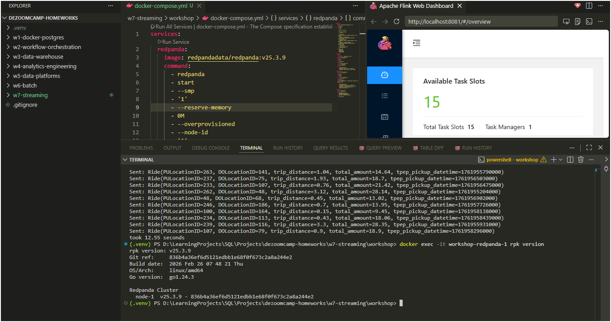
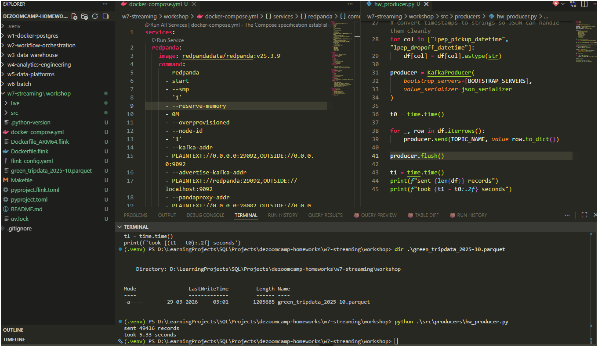
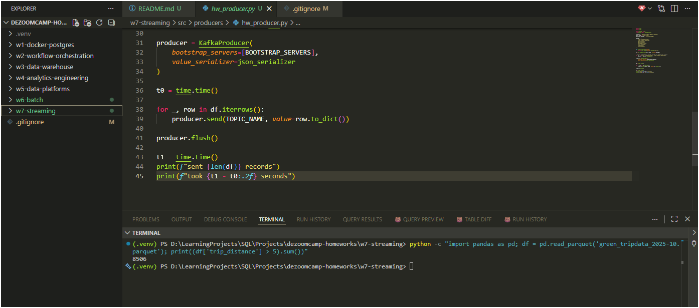
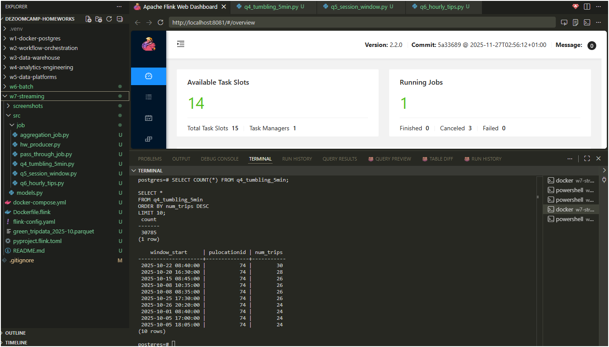
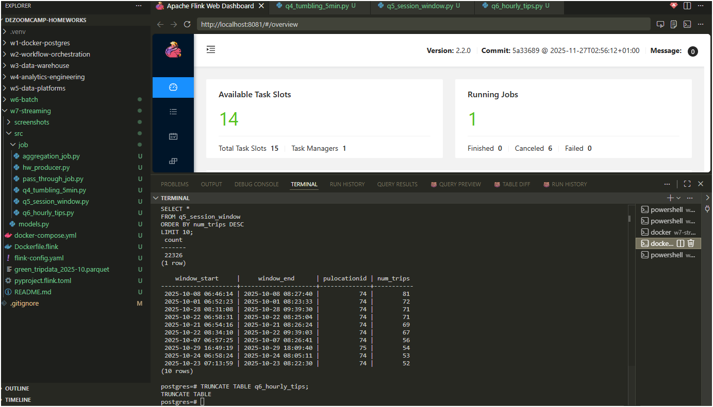
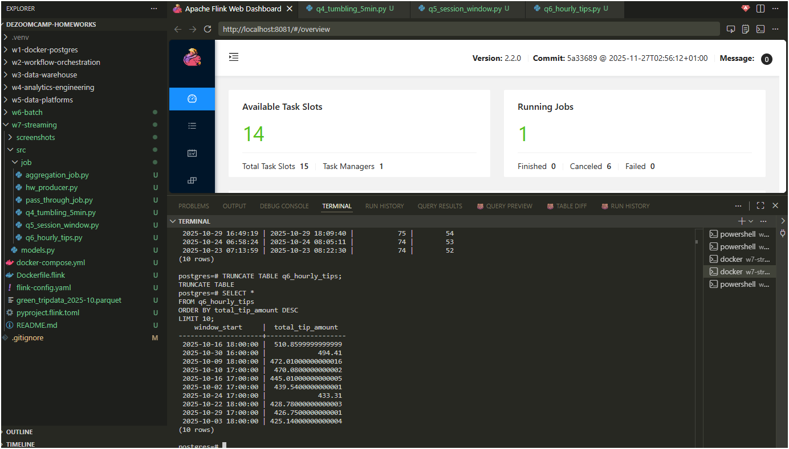

# 🌊 Data Engineering Zoomcamp – Homework 7: Streaming

## 🚀 Setup

* Streaming engine: **Apache Flink (PyFlink)**
* Message broker: **Redpanda (Kafka-compatible)**
* Sink: **PostgreSQL**
* Data source: NYC Green Taxi (Parquet → streamed via Python producer)
* Execution: Docker-based environment

---

## ▶️ Running the Pipeline

### 1. Start infrastructure

```bash
docker compose up -d
```

---

### 2. Produce streaming data

```bash
python src/producers/producer.py
```

👉 Sends ~49,416 records to Kafka topic `green-trips`

---

### 3. Run Flink jobs

Example:

```bash
docker exec -it workshop-jobmanager-1 flink run -py /opt/src/job/q6_hourly_tips.py
```

---

### 4. Query results (Postgres)

```bash
docker exec -it workshop-postgres-1 psql -U postgres -d postgres
```

---

## 📂 Project Structure

```
w7-streaming/
│
├── src/
│   ├── producers/
│   │   ├── producer.py
│   │   ├── producer_realtime.py
│   │   └── hw_producer.py
│   │
│   ├── job/
│   │   ├── pass_through_job.py
│   │   ├── aggregation_job.py
│   │   ├── q4_tumbling_5min.py
│   │   ├── q5_session_window.py
│   │   └── q6_hourly_tips.py
│   │
│   └── consumers/
│
├── screenshots/
│   ├── q1_version.png
│   ├── q2_latency.png
│   ├── q3_distance.png
│   ├── q4_tumbling.png
│   ├── q5_session.png
│   └── q6_hourly.png
│
├── docker-compose.yml
├── Dockerfile.flink
└── README.md
```

---

## 🧠 Architecture

```
Parquet → Python Producer → Redpanda (Kafka)
→ Flink Streaming Jobs → PostgreSQL → SQL Queries
```

---

## 📊 Homework Submission

---

## Q1. Redpanda Version

```bash
rpk version
```

**Answer:** `v25.3.9`



---

## Q2. Producer Latency

```python
time.sleep(0.1)
```

**Answer:** `10 seconds`



---

## Q3. Trips with Distance > 5

```python
(df['trip_distance'] > 5).sum()
```

**Answer:** `8506`



---

## Q4. 5-Minute Tumbling Window (Top Zone)

```sql
SELECT PULocationID, num_trips
FROM q4_tumbling_5min
ORDER BY num_trips DESC
LIMIT 5;
```

**Answer:** `74`



---

## Q5. Session Window (Max Trips)

```sql
SELECT PULocationID, num_trips
FROM q5_session_window
ORDER BY num_trips DESC;
```

**Answer:** `81`



---

## Q6. 1-Hour Window (Max Tip Amount)

```sql
SELECT window_start, total_tip_amount
FROM q6_hourly_tips
ORDER BY total_tip_amount DESC
LIMIT 5;
```

**Answer:** `2025-10-16 18:00:00`



---

## ⚙️ Key Concepts

* **Streaming vs Batch**

  * Streaming = continuous, unbounded data
* **Windows**

  * Tumbling → fixed intervals
  * Session → activity-based grouping
* **Watermarks**

  * Handle late-arriving data
* **Kafka / Redpanda**

  * Topic-based streaming system
* **Flink**

  * Stateful real-time processing engine

---


## ✅ Results

* Successfully built a **real-time streaming pipeline**
* Processed ~49k events through Kafka → Flink → Postgres
* Implemented:

  * pass-through streaming
  * aggregations
  * tumbling windows
  * session windows
* Validated outputs using SQL queries

---


# 💡 Final Note

This homework demonstrates end-to-end understanding of:

* event streaming
* real-time processing
* stateful computation
* windowing logic

---
